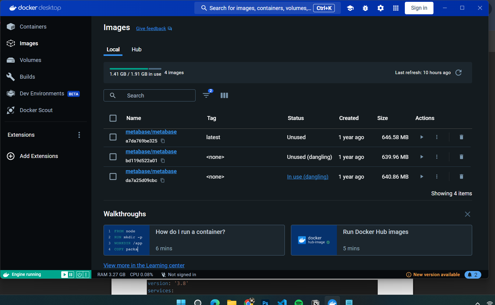
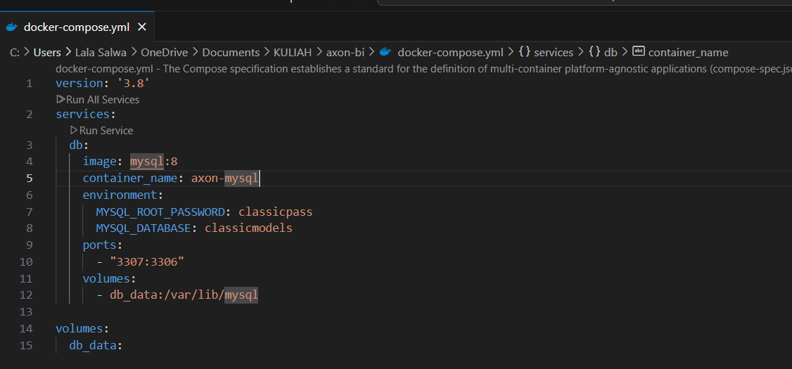
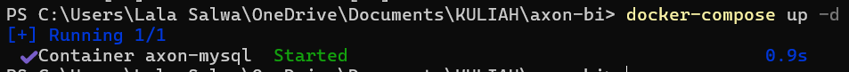
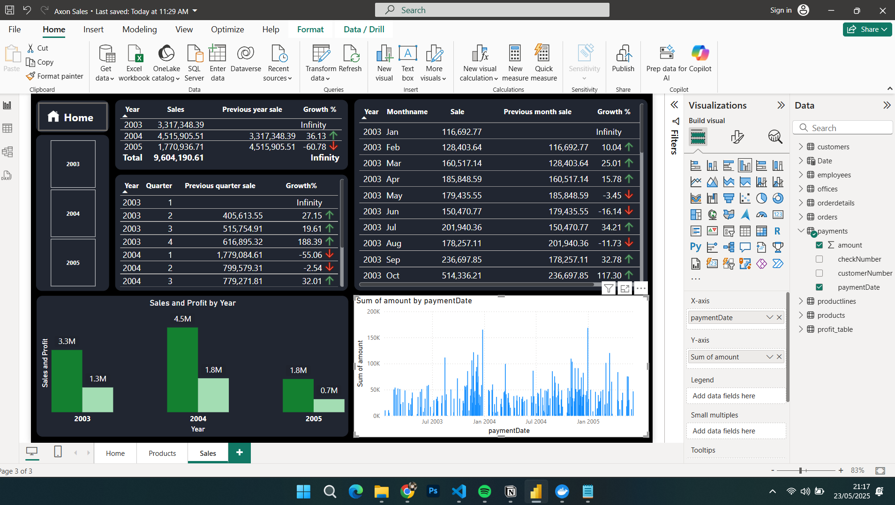

# Project 1

25 Mei 2025

**LAPORAN PROJECT UAS 1**

“Project 1. Membuat Container System Sederhana”

Mata kuliah Workshop Administrasi Jaringan

Nama dosen pengampu:

Bapak Dr Ferry Astika Saputra ST, M.Sc.

Dikerjakan oleh

Nama	: Salwa Fadhila Rahmania

NRP 	: 3123600008

Kelas	: 2 D4 IT

### **Membuat Container Sederhana**

1. Instalasi Docker Desktop

Fungsi Docker: platform yang memungkinkan mengemas, mengirim, dan menjalankan aplikasi dalam kontainer. Kontainer sendiri merupakan unit yang mengemas kode aplikasi beserta dependensinya sehingga aplikasi dapat berjalan dengan cepat dan  andal dari satu lingkungan komputasi ke komputer lainnya.

Tujuan Instalasi: instalasi Docker  untuk dapat menjalankan konfigurasi MySQL yang didefinisikan dalam file docker-compose.yml ini, memungkinkan untuk memiliki database MySQL yang mudah diatur, konsisten, dan terisolasi untuk kebutuhan pengembangan, pengujian,

1. Konfigurasi Docker dengan MYSQL
2. 

Fungsi docker-compose.yml: file docker-compose.yml mendefinisikan, mengkonfigurasi, dan menjalankan aplikasi multi-container Docker.

hasil conect:

1. Instalasi Power BI Desktop

Fungsi Power BI: Power BI adalah layanan analitik bisnis dari Microsoft yang memungkinkan memvisualisasikan data dan berbagi wawasan. Power BI dapat terhubung ke database MySQL yang berjalan di dalam kontainer Docker yang sudah di konfigurasi sebelumnya.

1. Hasil Visualisasi Data Di Power BI

Setelah berhasil konfigurasi MYSQL dan berjalan di port 3307 maka dapat menampilkan data dari file AXON yang sudah disediakan.

Hasil:

Analisis:

1. Tabel data AXON:
    1. Customers
    2. employees
    3. offices
    4. orderdetails
    5. orders
    6. payments
    7. productline
    8. products
    9. profit_table
2. Hubungan Docker, MySQL, dan Power BI untuk data AXON

Adanya Docker untuk mengubah cara mengelola dan mengakses database MySQL, kemudian menjadi sumber data untuk Power BI.

1. hasil dari visualisasi data:
    1. Analisis Penjualan Waktu-Nyata
    2. Kinerja Produk dan Lini Produk
    3. Analisis Pelanggan\
    4. Efisiensi Pesanan dan Pengiriman
    5. Kinerja Karyawan (Sales Rep)
    6. Analisis Profitabilitas Detail
2. Manfaat adanya docker pada case AXON ini:
    1. Lingkungan Pengembangan Lokal yang Cepat: Pengembang dan analis dapat dengan cepat meluncurkan lingkungan database MySQL yang siap digunakan di port lokal. Ini mempercepat siklus pengembangan laporan Power BI karena tidak perlu menunggu infrastruktur database yang terpisah.
    2. Konsistensi Data: Memastikan bahwa semua orang yang mengerjakan laporan Power BI memiliki akses ke versi data dan skema database yang sama, mencegah perbedaan setup database.
    3. Isolasi: Database MySQL berjalan di dalam kontainer yang terisolasi, sehingga tidak mengganggu instalasi perangkat lunak lain di port host.
    4. Mudah Skalabilitas: Meskipun hanya satu kontainer MySQL, Docker Compose adalah langkah pertama menuju arsitektur *microservices*. Cara ini bisa dengan mudah menambah atau mengganti database jika diperlukan tanpa mengotori sistem host.
    5. Portabilitas: File docker-compose.yml dapat dibagikan, dan siapa pun dapat meluncurkan database yang sama untuk Power BI mereka. Ini sangat berguna untuk tim yang berkolaborasi.