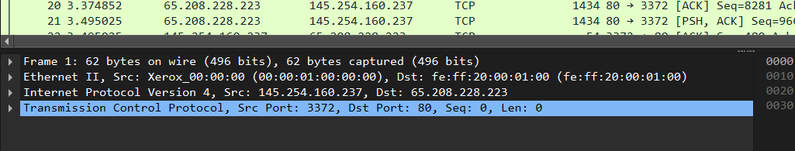

# Tugas Workshop Administrasi Jaringan [REVIEW]

| Mata Kuliah | Workshop Administrasi Jaringan  |
|----------|----------|
| Nama   | Salwa Fadhila Rahmania  | 
| NRP   | 3123600008   | 
| Kelas   | 2 D4 IT A   | 
| Dosen   | Dr Ferry Astika Saputra ST, M.Sc   | 

<br><br>
# Tugas Review 1

### 1. Download http.cap di https://wiki.wireshark.org/SampleCaptures
* Hasilnya :


### 2. Eksplor http.cap di wireshark, lakukan analisis:
1. IP server dan client
    * Tampilan awal
    

    * IP Server : 
     
    IP Client (Source IP - Src):
    145.254.160.237 ini adalah alamat sumber dalam paket yang ditampilkan, artinya perangkat dengan IP ini mengirimkan permintaan ke server.

    * IP Client : 
     
    P Server (Destination IP - Dst):
    65.208.228.223 adalah alamat tujuan, yang berarti perangkat dengan IP ini menerima permintaan dari client. Dengan melihat port tujuan(Dst Port) 80, dapat artikan bahwa ini adalah sebuah server web (HTTP server).

2. Versi HTTP
    * Hasil : 
     
    HTTP/1.1 menunjukkan bahwa versi http tersebut adalah versi 1.1

3. Waktu client mengirim request
    * Hasil : 
     
    Sesuai dengan digambar arah panah port 145.254.160.237 menuju port 65.208.228.223 mengirim request pertama pada time 0.91131 detik 

4. Waktu server menerima HTTP request dari client
     * Hasil : 
     
    Sesuai dengan digambar pada line " HTTP/1.1 200 Ok " arah panah port 65.208.228.223 menuju port 145.254.160.237 menerima kiriman respone pada time 4.846969 detik 

5. waktu yang dibutuhkan untuk transfer dan response dari client ke server

``` 
waktu respone - waktu kirim =  4.846969 - 0.911310 = 3.955688 detik
``` 
* Butki pada graph: 
     
    Pada gambar terlihat waktu yang dibutuhkan untuk transfer dan response dari client ke server dari arah panah port 216.239.59.99 kembali ke port 145.254.160.237 adalah 3.955688 detik<br><br>
# Tugas 2 [Analisis Gambar]
* Figure 23.1 Types of data deliveries
    * Gambar : 
      
    Gambar ini menunjukkan bagaimana data dikirimkan dari satu proses pada satu perangkat ke proses lain di perangkat tujuan melalui beberapa lapisan jaringan.
    * Jelaskan proses yang terjadi dalam gambar tersebut.  
        1. Node to Node (Data Link Layer - Lapisan Data Link)
            1. Komunikasi antar perangkat jaringan (misalnya, komputer, router, atau switch).
            2. Terjadi dalam satu segmen jaringan (misalnya, LAN atau satu hop dalam jaringan WAN).
            3. Menggunakan alamat MAC (Media Access Control) untuk mengirimkan data antar node (perangkat).
            4. Protokol yang digunakan bisa berupa Ethernet, Wi-Fi, atau PPP (Point-to-Point Protocol).  
        2. Host to Host (Network Layer - Lapisan Jaringan)
            1. Komunikasi antar host (komputer pengirim dan penerima) melewati beberapa router dalam jaringan.
            2. Menggunakan alamat IP (Internet Protocol) untuk menentukan tujuan paket data.
            3. Data dikirim dalam bentuk paket dan dapat melewati banyak node (router) di internet.
            4. Protokol yang digunakan adalah IP (Internet Protocol), ICMP (Internet Control Message Protocol), dan lain-lain.  

        3. Process to Process (Transport Layer - Lapisan Transportasi)
            1. Komunikasi antara proses aplikasi di perangkat pengirim dan penerima.
            2. Menggunakan port untuk mengarahkan data ke aplikasi yang benar.
            3. Contoh protokol yang digunakan adalah TCP (Transmission Control Protocol) dan UDP (User Datagram Protocol).
            4. Pada tahap ini, data dari aplikasi dikemas dalam bentuk segmen yang akan dikirim melalui jaringan.   
<br><br>
# Tugas 3 [Resume]

* Gambar : 
    
    Gambar di atas menunjukkan posisi UDP, TCP, dan SCTP dalam suite protokol TCP/IP, yang mencakup lapisan-lapisan dalam model TCP/IP. Fokus utama kita adalah pada lapisan transport (Transport Layer) yang berisi TCP (Transmission Control Protocol), UDP, dan SCTP.

* Resume tahapan TCP, establishment, data transfer, termination
    1. Connection Establishment (Establishing Connection):   
        1. Pada tahap ini, TCP membentuk koneksi antara dua perangkat menggunakan Three-Way Handshake, yang terjadi pada lapisan transport di gambar.  

        2. Three-Way Handshake:
            1. SYN (Synchronize) → Klien mengirimkan paket SYN ke server untuk memulai koneksi.
            2. SYN-ACK (Synchronize-Acknowledge) → Server membalas dengan paket SYN-ACK sebagai tanda bahwa permintaan diterima.
            3. ACK (Acknowledge) → Klien mengirim ACK sebagai konfirmasi, dan koneksi TCP pun terbentuk.
            4. Tahap ini terjadi di lapisan transport pada gambar, di mana TCP bertanggung jawab atas koneksi yang andal.  <br>
    2. Data Transfer  
    Setelah koneksi berhasil dibuat, TCP mulai mentransfer data secara andal.

        Fitur utama dalam tahap ini:
        1. Penomoran dan Pengurutan (Sequencing) → Data dikirim dalam bentuk segmen TCP dengan nomor urut, sehingga penerima dapat menyusun ulang paket dengan benar.
        2. Error Checking & Retransmission → Jika ada segmen yang hilang atau rusak, TCP akan meminta pengiriman ulang.
        3. Flow Control (Pengendalian Aliran) → TCP menggunakan Sliding Window untuk mengontrol jumlah data yang dikirim sebelum menunggu ACK.
        4. Congestion Control (Pengendalian Kemacetan) → TCP mengatur kecepatan pengiriman data untuk menghindari kemacetan jaringan.
        5. Data dikirim melalui lapisan transport, menggunakan protokol TCP seperti yang terlihat di gambar.    

    3. Connection Termination  
        Setelah data selesai dikirim, TCP menutup koneksi menggunakan Four-Way Handshake untuk memastikan tidak ada data yang tertinggal.

        Four-Way Handshake:  
        1. FIN (Finish) dari Klien → Klien mengirim FIN ke server untuk meminta penghentian koneksi.
        2. ACK dari Server → Server mengakui permintaan dengan mengirim ACK.
        3. FIN dari Server → Server mengirim FIN ke klien untuk menutup koneksi dari sisi server.
        4. ACK dari Klien → Klien mengirim ACK sebagai konfirmasi terakhir sebelum koneksi benar-benar tertutup.
        5. Setelah tahap ini selesai, koneksi TCP dianggap ditutup, dan sumber daya jaringan dilepaskan.