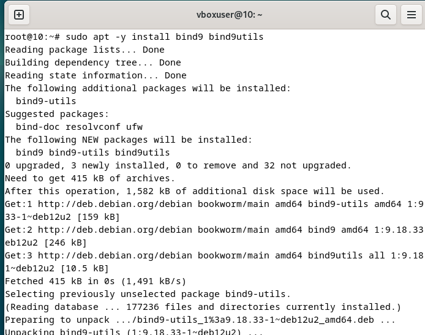

# Tugas DNS

Mata kuliah : Workshop Administrasi Jaringan

Dosen Pengampu : Dr Ferry Astika Saputra ST, M.Sc.

Nama : Salwa Fadhila Rahmania

Kelas :  2 D4 IT A

NRP : 3123600008

---

## **Konfigurasi DNS untuk Jaringan Internal**

1. Install Bind
    
    
    

1. Konfigurasi Bind dengan Jaringan Internal
    
    
    
    
    
    
    

1. Konfigurasi fileRestart dan check status
    
    
    
    
    

1. restart dan check status
    
    
    

1. Hasil
    
    
    

---

## **Konfigurasi DNS untuk Jaringan External**

1. Membuat bind eksternal
    
    
    

1. konfigurasi jaringan eksternal
    
    
    

1. konfigurasi zone
    
    
    
    
    

1. Restart dan check
    
    
    

---